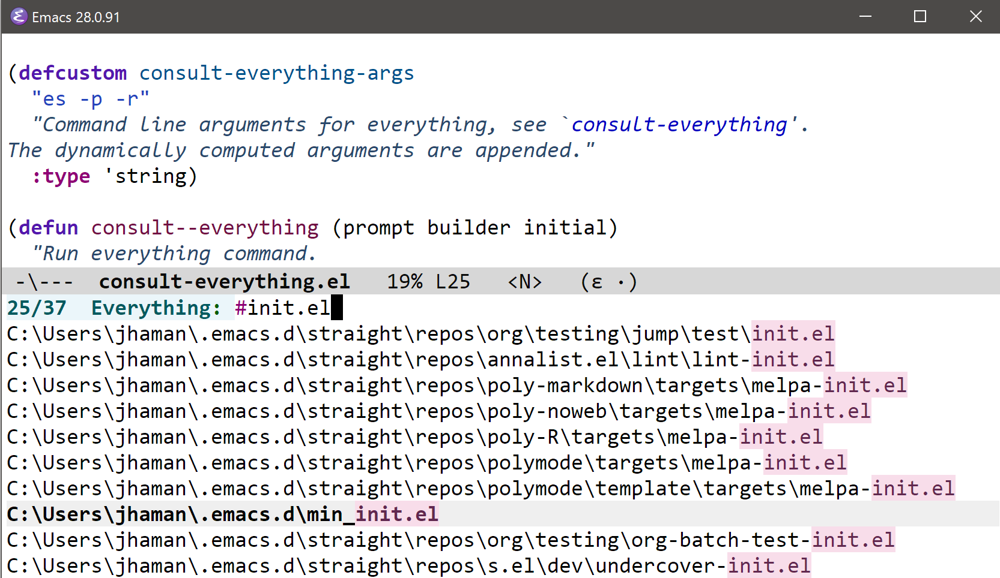

# `consult-everything`

Use [Consult](https://github.com/minad/consult) to read results from [Everything](https://www.voidtools.com/support/everything/command_line_interface/).

## Requirements

- Windows OS
- [Everything command line interface](https://www.voidtools.com/support/everything/command_line_interface/)
- A recent version of Emacs for Windows.

## Installation

Install from Github via [straight.el](https://github.com/radian-software/straight.el) until the software is available on MELPA or ELPA. The package depends on consult.el and orderless.el.

A simple package installation recipe is

```emacs-lisp
(use-package consult-everything
  :straight (consult-everything :host github :repo "jthaman/consult-everything"))
```

I use this use-package incantation:

```emacs-lisp
(use-package consult-everything
  :if (eq system-type 'windows-nt)
  :after consult
  :load-path "~/lisp/consult-everything/"
  :config
  (general-define-key ; set key in Normal state for Evil users.
   :states 'normal
   "SPC L" 'consult-everything))
```

## Recommendation

Install the [embark](https://github.com/oantolin/embark) package to open files externally from the minibuffer, rather than in Emacs.


